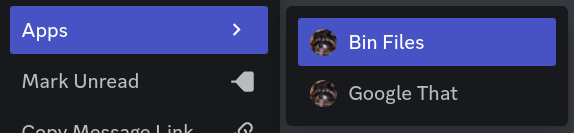
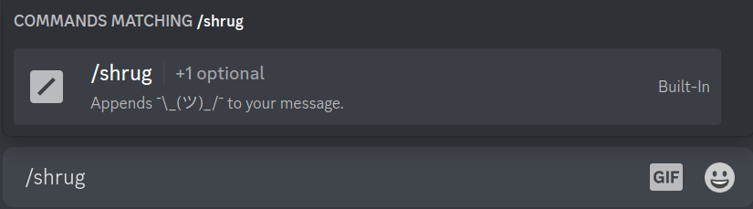

# Implementation Guides

---

All packages referenced are under the root `net.insprill.robotinsprill` package.  
For more information on Kord, check out their [Wiki](https://github.com/kordlib/kord/wiki)
and [Dokka](https://kordlib.github.io/kord/) docs.

Use the table of contents on the right to see all guides available here.

## Adding Commands

Robot Insprill supports two types of commands:

- Message Commands
- Slash Commands

Message commands are the commands you see under 'Apps' when right-clicking a message.


Slash commands are the commands you see when typing in a forward slash (`/`)


### Message Commands

To add a message command, create a new class in the `command.message` package.
This class should extend `MessageCommand`

```kotlin
class MyCommand : MessageCommand() 
```

To set the name of the command, you'll need to override the `name` parameter.

```kotlin
override val name: String
    get() = "My Epic Command"
```

For the command's functionality, you'll need to override the `execute` function.

```kotlin
import dev.kord.core.event.interaction.MessageCommandInteractionCreateEvent

override suspend fun execute(context: MessageCommandInteractionCreateEvent) {

}
```

If you need to do something when the command is registered, you can override the `setup` function. This is not required.

```kotlin
import dev.kord.rest.builder.interaction.MessageCommandCreateBuilder

override fun setup(builder: MessageCommandCreateBuilder) {

}
```

Now that you have your command class, you'll need to register it.  
This can be done in the `RobotInsprill` class.
Head to the `#registerCommands` function, and the call to `CommandManager#registerCommands`.
As the second parameter, you'll see a `listOf` function call with some other message commands in it.
Simply add your command to this list, and you're good to go!

### Slash Commands

To add a slash command, create a new class in the `command.slash` package.
This class should extend `SlashCommand`

```kotlin
class MyCommand : SlashCommand() 
```

To set the name and description of the command, you'll need to override the respective parameters.

```kotlin
override val name: String
    get() = "My Epic Command"
override val name: String
    get() = "Does something awesome"
```

For the command's functionality, you'll need to override the `execute` function.

```kotlin
import dev.kord.core.event.interaction.ChatInputCommandInteractionCreateEvent

override suspend fun execute(context: ChatInputCommandInteractionCreateEvent) {

}
```

If you need to do something when the command is registered, you can override the `setup` function. This is not required.

```kotlin
import dev.kord.rest.builder.interaction.ChatInputCreateBuilder

override fun setup(builder: ChatInputCreateBuilder) {

}
```

Now that you have your command class, you'll need to register it.  
This can be done in the `RobotInsprill` class.
Head to the `#registerCommands` function, and the call to `CommandManager#registerCommands`.
As the first parameter, you'll see an `arrayOf` function call with some other slash commands in it.
Simply add your command to this list, and you're good to go!

## Audit Logs

### Category

To add a new audit log category, create a new class in the `audit.category` package.
This class should extend `AuditCategory`, passing in the same values to its constructor

```kotlin
import net.insprill.robotinsprill.RobotInsprill
import net.insprill.robotinsprill.audit.AuditManager

class AuditSomethingCool(robot: RobotInsprill, audit: AuditManager) : AuditCategory(robot, audit) 
```

Audit logging is done though Kord events.  
These events must be registered in the overridden `registerEvents` function.

```kotlin
override fun registerEvents() {

}
```

To register events, we use the `event` function from the `AuditCategory` class.  
The generic parameter is the Kord event to listen to. In this example, the `BanAddEvent`.
The other parameter is a boolean defining whether this log is enabled. It should be taken from the `BotConfig`.

```kotlin
event<BanAddEvent>(config.banned) {

}
```

To log the action, you can use the `send` function.
This comes in two variants:

- `#send(user: User?, color: AuditColor, title: String, description: String?)`
- `#send(color: AuditColor, title: String, footer: String?)`

The former should be used when logging events performed by, or including a user.
The latter should be used when logging events that aren't associated with a user.

Now that you have your audit log category, you'll need to register it.
This can be done in the `AuditManager` class. Head to the `#setupEventHandlers` function, and you'll see a call
to `arrayOf` containing other categories.
Simply add your category to that list, and you're good to go!

## Configuration

To add new configuration options, you'll need to modify the `BotConfig` class in the `configuration` package.
This class may look a little overwhelming at first, but it's actually quite simple.
The first data class, `BotConfig`, is the root of the config file.
You'll see here all the root keys you see in the `dev.yml` file.

Inside of that, you'll see other data classes, each representing a level of the config file.
If you pull up the `dev.yml` file next to the class, you'll start to see the resemblance.

Once you're familiar with the layout of the class, you're ready to add your own options to it.
Options should be defined in `snakeCase` in the class, and `kebab-case` in the configuration file.

We use [Hoplite](https://github.com/sksamuel/hoplite) for deserialization of the file, and it'll automatically convert
between the cases.

Try to keep data classes as nested as possible to restrict the scope of them to keep the class organized, and similar to
the actual config.

Hoplite supports [many data types](https://github.com/sksamuel/hoplite#decoders) for decoding.
In addition to this, we have implemented decoders for the following classes:

- `dev.kord.common.Color`
- `dev.kord.common.entity.Snowflake`

If you want to add a decoder for a new class, you can create it in the `hoplite.decoder` package.
The classes there should provide you with a good template for simple classes.
Once it's created, add it to the file `src/resources/META-INF/services/com.sksamuel.hoplite.decoder.Decoder`.

### Responses

Responding to interactions with a text message or embed is fairly common, so there's an easy way to handle it.

The BotConfig has a subclass called `Message`, that can have `text` and multiple `embeds`.
This can easily be integrated into an interaction response like the following

```kotlin
val message: BotConfig.Message = ...
context.interaction.respondPublic {
    content = message.text
    message.embeds()?.let { embeds.addAll(it) }
}
```

## Statistics

Implementing statistics is done in the `Statistic` enum in the `statistic` package.
The enum name will be used in the config, and should roughly follow the format `CATEGORY_NAME`.

The enums take a single parameter of `(RobotInsprill, Guild, String?) -> String`.  
The first parameter is an instance of `RobotInsprill` that can be used for logging.  
The second parameter is a `Guild` that can be used to get information about the bot's guild.  
The final parameter is the optional `data` string defined in the config.  
This can be used for passing in additional data, like a channel ID for YouTube stats.  
The function should return a string that will be inserted into the channel name.  
Try to keep the string as short as possible.  
When returning numbers, call the `net.insprill.robotinsprill.extension.pretty` function to round and pretty print it.
