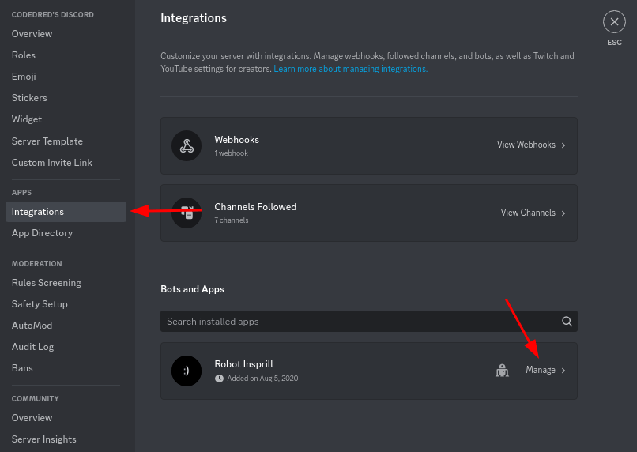
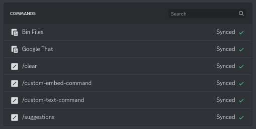
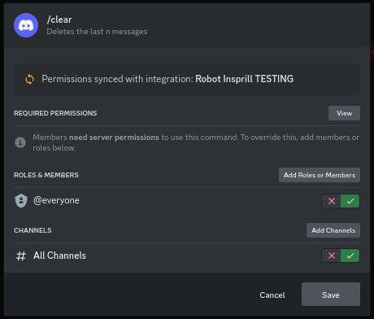

# Permissions

---

Robot Insprill doesn't offer a way to configure command permission via the config.
For this, you'll have to use Discord's built-in permission management for integration commands.

In your server settings, navigate to 'Integrations', then click on Robot Insprill.  

You will see a list of all commands.  

If you click one of the commands, you'll see the required permission if it has one, and options to customize them.  

For more information on this system of managing permissions,
check out [Discord's article it](https://support.discord.com/hc/en-us/articles/10952896421783).
